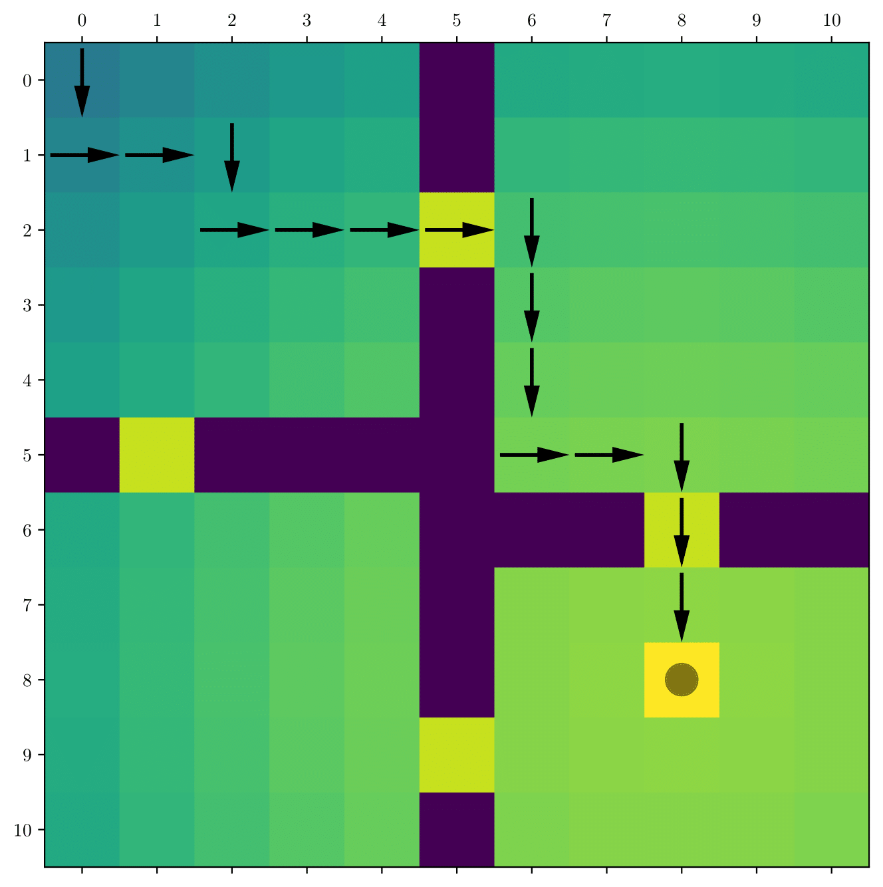

# ACC 2022
This repo contains the codes for the American Control Conference (2022) paper titled "Sample efficient transfer in reinforcement learning for high variable cost environments with inaccurate source reward model". 

     

